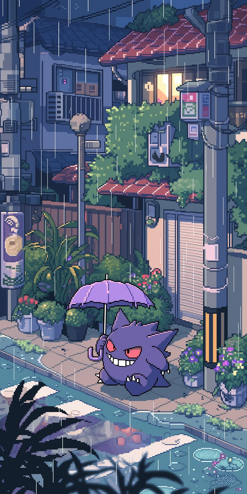
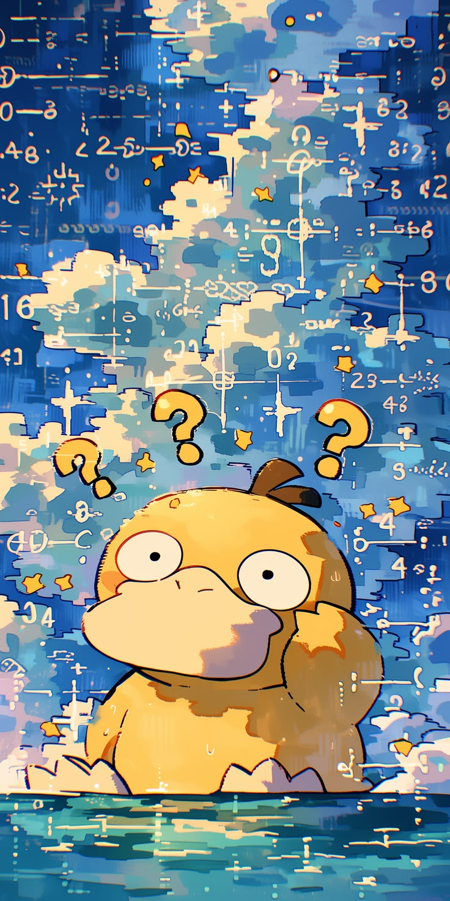

  

<pre>
    🎓 Cybersecurity Student • Junior Pentester
    🔐 Web Application Security • VAPT
    🧠 OWASP Top 10 • Recon • Web Exploitation
    ⚔️ Burp Suite • Nmap • Metasploit • Nessus
    🏴 CTF Player • CTF Organizer 
    🎮 Gaming • Linux  • Security Research
</pre>

 

  

<!--

